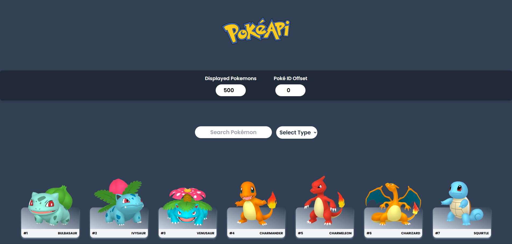
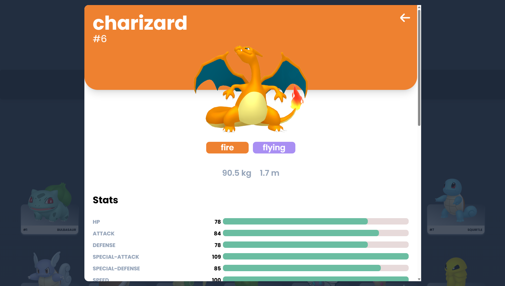

# React + Vite Pokédex App

Welcome to the **Pokédex App**! This application is crafted with the power of **React** and the speed of **Vite**. Dive into the world of Pokémon where you can effortlessly search for your favorite Pokémon, explore their detailed stats, abilities, and moves, and filter them to suit your preferences. Enjoy a seamless and responsive experience!

### ✨Features

- Search for Pokémon by name
- View detailed information about each Pokémon, including abilities, stats, and moves
- Filter Pokémon by displayed count and offset
- Responsive design

## 🚀Getting Started

### Run Locally

Clone the repository:

```bash
git clone https://github.com/dimitrisAvgoustopoulos/react-pokedex-app.git
```

Navigate to the project directory:

```bash
cd react-pokedex-app
```

Install the dependencies:

```bash
npm install
```

Start the development server:

```bash
npm run dev
```

## 🌍Enjoy Online

Check it out and give it a try: [React Pokedex App](https://react-pokedex-app-seven.vercel.app/)

## Screenshots

<br><br>


